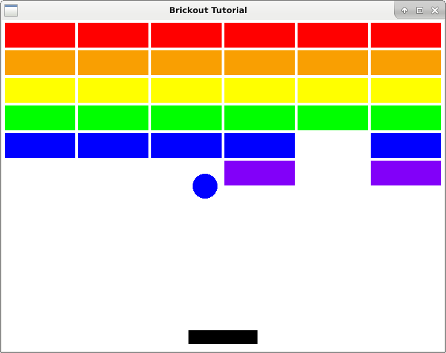

# Break some bricks

<figure><figcaption><p>Simple but working brickout gamec</p></figcaption></figure>

The last brickout tutorial in this series. We break a few bricks. There some major things missing like being able to lose, or start over. But a gameover screen would require us to use textures (which we will get into in Invaders).

```c
#include <epoxy/gl.h>
#include <epoxy/glx.h>
#include <gtk/gtk.h>
#include <math.h>
#include "DashGL/dashgl.h"

#define WIDTH 640.0f
#define HEIGHT 480.0f

static void on_realize(GtkGLArea *area);
static void on_render(GtkGLArea *area, GdkGLContext *context);
static gboolean on_idle(gpointer data);
static gboolean on_keydown(GtkWidget *widget, GdkEventKey *event);
static gboolean on_keyup(GtkWidget *widget, GdkEventKey *event);

struct {
	float dx, dy;
	float r;
	vec3 pos;
	vec3 color;
	mat4 mvp;
	GLuint vbo;
	gboolean left, right, top, bottom;
} ball;

struct {
	float width;
	float height;
	float dx;
	vec3 pos;
	vec3 color;
	mat4 mvp;
	GLuint vbo;
	gboolean key_left;
	gboolean key_right;
} paddle;

struct bricks {
	float width;
	float height;
	mat4 mvp[36];
	vec3 pos[36];
	gboolean on[36];
	vec3 color[6];
	GLuint vbo;
} bricks;

GLuint program;
GLuint vao;
GLint attribute_coord2d;
GLint uniform_mvp, uniform_color;

int main(int argc, char *argv[]) {

	GtkWidget *window;
	GtkWidget *glArea;

	gtk_init(&argc, &argv);

	// Initialize Window

	window = gtk_window_new(GTK_WINDOW_TOPLEVEL);
	gtk_window_set_title(GTK_WINDOW(window), "Brickout Tutorial");
	gtk_window_set_position(GTK_WINDOW(window), GTK_WIN_POS_CENTER);
	gtk_window_set_default_size(GTK_WINDOW(window), 640, 480);
	gtk_window_set_type_hint(GTK_WINDOW(window), GDK_WINDOW_TYPE_HINT_UTILITY);
	g_signal_connect(window, "destroy", G_CALLBACK(gtk_main_quit), NULL);
	g_signal_connect(window, "key-press-event", G_CALLBACK(on_keydown), NULL);
	g_signal_connect(window, "key-release-event", G_CALLBACK(on_keyup), NULL);

	// Initialize GTK GL Area

	glArea = gtk_gl_area_new();
	gtk_widget_set_vexpand(glArea, TRUE);
	gtk_widget_set_hexpand(glArea, TRUE);
	g_signal_connect(glArea, "realize", G_CALLBACK(on_realize), NULL);
	g_signal_connect(glArea, "render", G_CALLBACK(on_render), NULL);
	gtk_container_add(GTK_CONTAINER(window), glArea);

	// Show widgets

	gtk_widget_show_all(window);
	gtk_main();

	return 0;

}

static void on_realize(GtkGLArea *area) {

	// Debug Message

	g_print("on realize\n");

	gtk_gl_area_make_current(area);
	if(gtk_gl_area_get_error(area) != NULL) {
		fprintf(stderr, "Unknown error\n");
		return;
	}
	
	const GLubyte *renderer = glGetString(GL_RENDER);
	const GLubyte *version = glGetString(GL_VERSION);
	const GLubyte *shader = glGetString(GL_SHADING_LANGUAGE_VERSION);

	printf("Shader %s\n", shader);
	printf("Renderer: %s\n", renderer);
	printf("OpenGL version supported %s\n", version);

	glClearColor(1.0f, 1.0f, 1.0f, 1.0f);

	glGenVertexArrays(1, &vao);
	glBindVertexArray(vao);

	ball.r = 18.0f;

	int i;
	float angle, nextAngle;
	int num_segments = 99;

	GLfloat circle_vertices[6 * 100];
	
	for(i = 0; i bricks.on[i] = TRUE;
			mat4_translate(bricks.pos[i], bricks.mvp[i]);
		}
	}

}

static void on_render(GtkGLArea *area, GdkGLContext *context) {

	glClear(GL_COLOR_BUFFER_BIT | GL_DEPTH_BUFFER_BIT);

	mat4_translate(ball.pos, ball.mvp);
	glUniformMatrix4fv(uniform_mvp, 1, GL_FALSE, ball.mvp);
	glUniform3fv(uniform_color, 1, ball.color);

	glBindVertexArray(vao);
	glEnableVertexAttribArray(attribute_coord2d);

	glBindBuffer(GL_ARRAY_BUFFER, ball.vbo);
	glVertexAttribPointer(
		attribute_coord2d,
		2,
		GL_FLOAT,
		GL_FALSE,
		0,
		0
	);
	glDrawArrays(GL_TRIANGLES, 0, 3 * 100);

	mat4_translate(paddle.pos, paddle.mvp);
	glUniformMatrix4fv(uniform_mvp, 1, GL_FALSE, paddle.mvp);
	glUniform3fv(uniform_color, 1, paddle.color);

	glBindBuffer(GL_ARRAY_BUFFER, paddle.vbo);
	glVertexAttribPointer(
		attribute_coord2d,
		2,
		GL_FLOAT,
		GL_FALSE,
		0,
		0
	);
	glDrawArrays(GL_TRIANGLES, 0, 3 * 2);
	
	glBindBuffer(GL_ARRAY_BUFFER, bricks.vbo);
	glVertexAttribPointer(
		attribute_coord2d,
		2,
		GL_FLOAT,
		GL_FALSE,
		0,
		0
	);

	int i, x, y;
	for(y = 0; y <6; y++) {

		glUniform3fv(uniform_color, 1, bricks.color[y]);

		for(x = 0; x <6; x++) {
			i = y* 6 + x;
			
			if(!bricks.on[i]) {
				continue;
			}

			glUniformMatrix4fv(uniform_mvp, 1, GL_FALSE, bricks.mvp[i]);
			glDrawArrays(GL_TRIANGLES, 0, 3 * 2);
		}
	}

	glDisableVertexAttribArray(attribute_coord2d);

}

static gboolean on_idle(gpointer data) {

	int i;

	for(i = 0; i <36; i++) {
		
		if(!bricks.on[i]) {
			continue;
		}

		ball.left = ball.pos[0] - ball.r > bricks.pos[i][0] - bricks.width;
		ball.right = ball.pos[0] + ball.r  bricks.pos[i][1] - bricks.width;
		ball.top = ball.pos[1] + ball.r 

	ball.pos[0] += ball.dx;
	ball.pos[1] += ball.dy;

	if(ball.pos[0] > WIDTH) {
		ball.pos[0] = WIDTH;
		ball.dx *= -1;
	} else if(ball.pos[0] <0) {
		ball.pos[0] = 0;
		ball.dx *= -1;
	}

	if(ball.pos[1] > HEIGHT) {
		ball.pos[1] = HEIGHT;
		ball.dy *= -1;
	} else if(ball.pos[1] <0) {
		ball.pos[1] = 0;
		ball.dy *= -1;
	}

	if(paddle.key_left) {
		paddle.pos[0] -= paddle.dx;
	}

	if(paddle.key_right) {
		paddle.pos[0] += paddle.dx;
	}

	if(paddle.pos[0] <0) {
		paddle.pos[0] = 0.0f;
	} else if(paddle.pos[0] > WIDTH) {
		paddle.pos[0] = WIDTH;
	}

	ball.left = ball.pos[0] > paddle.pos[0] - paddle.width;
	ball.right = ball.pos[0]  paddle.pos[1] - paddle.height;

	if(ball.dy <0 && ball.left && ball.right && ball.top && ball.bottom) {
		ball.dy *= -1.025;
	}

	gtk_widget_queue_draw(GTK_WIDGET(data));
	return TRUE;

}

static gboolean on_keydown(GtkWidget *widget, GdkEventKey *event) {

	switch(event->keyval) {
		case GDK_KEY_Left:
			paddle.key_left = TRUE;
		break;
		case GDK_KEY_Right:
			paddle.key_right = TRUE;
		break;
	}

}

static gboolean on_keyup(GtkWidget *widget, GdkEventKey *event) {

	switch(event->keyval) {
		case GDK_KEY_Left:
			paddle.key_left = FALSE;
		break;
		case GDK_KEY_Right:
			paddle.key_right = FALSE;
		break;
	}

}
```

Compile with:

```bash
$ gcc -c -o DashGL/dashgl.o DashGL/dashgl.c -lepoxy -lpng -lm
$ gcc `pkg-config --cflags gtk+-3.0` main.c DashGL/dashgl.o `pkg-config --libs gtk+-3.0` \
-lepoxy -lm -lpng
```

Run with:

```bash
$ ./a.out
```
