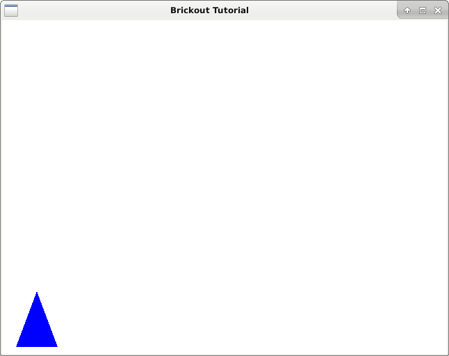
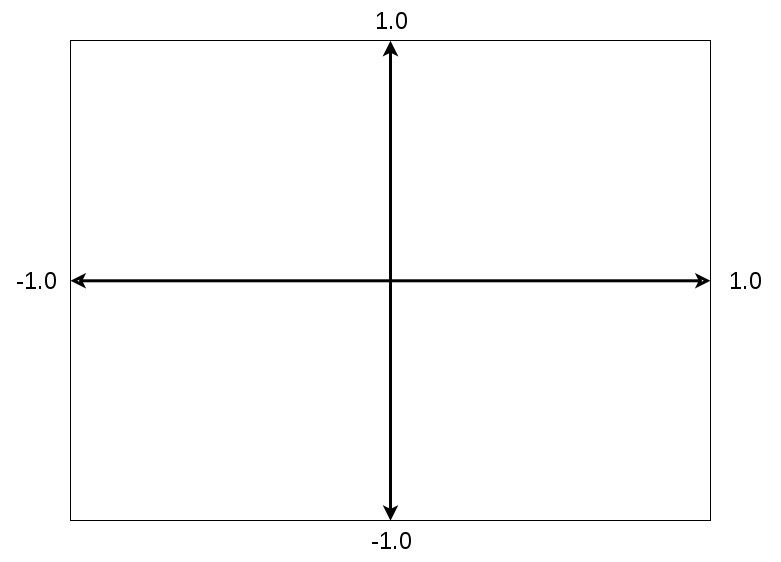
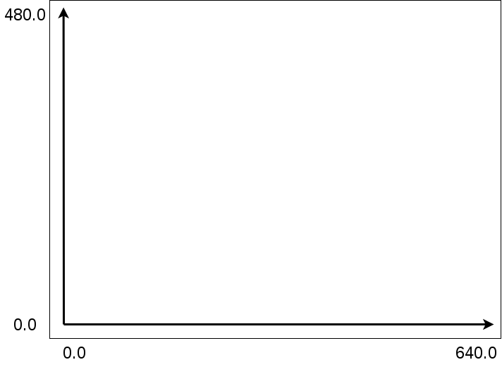

# Orthagonal Coordinates

<figure><figcaption><p>Blue triangle with orthogonal coordinates</p></figcaption></figure>

OpenGL uses cartisian coordinates by default. That means it defines the top of the viewport as 1.0 and the bottom as -1.0 as the y-axis and 1.0 on the right and -1.0 on the left as the x-axis.

<figure><figcaption><p>cartisian coordinates</p></figcaption></figure>

I suppose the idea is that OpenGL doesn't try to assume what the end user wants to do and provides something standard that will work for any viewport. In this case, since we're working with 2D, we simply would like to be able to use pixel coordinates, (also called Orthogonal coordinates) so we can use coordinates relative to the 640x480 window size we have defined.

<figure><figcaption><p>Orthogonal coordinates</p></figcaption></figure>

To do this, we're going to edit our vertex shader to look like this.bas

```glsl
#version 120

uniform mat4 orthograph;
attribute vec2 coord2d;

void main (void) {
	
	gl_Position = orthograph * vec4(coord2d, 0.0, 1.0);

}
```

We add a new variable a _uniform_, which gets set once and stays the same until we redefine it, as opposed to an attribute which are variables that are fed into our shader. In this case we will define a 4x4 matrix to convert our pixel coordinates back into standard coordinates.

So next we need to edit our main file to define our orthographic matrix and pass the value into our shader program.

```c
#include <epoxy/gl.h>
#include <epoxy/glx.h>
#include <gtk/gtk.h>
#include "DashGL/dashgl.h"

#define WIDTH 640.0f
#define HEIGHT 480.0f

static void on_realize(GtkGLArea *area);
static void on_render(GtkGLArea *area, GdkGLContext *context);

GLuint program;
GLuint vao, vbo_triangle;
GLint attribute_coord2d;

int main(int argc, char *argv[]) {

	GtkWidget *window;
	GtkWidget *glArea;

	gtk_init(&argc, &argv);

	// Initialize Window

	window = gtk_window_new(GTK_WINDOW_TOPLEVEL);
	gtk_window_set_title(GTK_WINDOW(window), "Brickout Tutorial");
	gtk_window_set_position(GTK_WINDOW(window), GTK_WIN_POS_CENTER);
	gtk_window_set_default_size(GTK_WINDOW(window), 640, 480);
	gtk_window_set_type_hint(GTK_WINDOW(window), GDK_WINDOW_TYPE_HINT_UTILITY);
	g_signal_connect(window, "destroy", G_CALLBACK(gtk_main_quit), NULL);

	// Initialize GTK GL Area

	glArea = gtk_gl_area_new();
	gtk_widget_set_vexpand(glArea, TRUE);
	gtk_widget_set_hexpand(glArea, TRUE);
	g_signal_connect(glArea, "realize", G_CALLBACK(on_realize), NULL);
	g_signal_connect(glArea, "render", G_CALLBACK(on_render), NULL);
	gtk_container_add(GTK_CONTAINER(window), glArea);

	// Show widgets

	gtk_widget_show_all(window);
	gtk_main();

	return 0;

}

static void on_realize(GtkGLArea *area) {

	// Debug Message

	g_print("on realize\n");

	gtk_gl_area_make_current(area);
	if(gtk_gl_area_get_error(area) != NULL) {
		fprintf(stderr, "Unknown error\n");
		return;
	}
	
	const GLubyte *renderer = glGetString(GL_RENDER);
	const GLubyte *version = glGetString(GL_VERSION);
	const GLubyte *shader = glGetString(GL_SHADING_LANGUAGE_VERSION);

	printf("Shader %s\n", shader);
	printf("Renderer: %s\n", renderer);
	printf("OpenGL version supported %s\n", version);

	glClearColor(1.0f, 1.0f, 1.0f, 1.0f);

	glGenVertexArrays(1, &vao);
	glBindVertexArray(vao);

	GLfloat triangle_vertices[] = {
		 20.0, 10.0,
		 50.0, 90.0,
		 80.0, 10.0
	};
	
	glGenBuffers(1, &vbo_triangle);
	glBindBuffer(GL_ARRAY_BUFFER, vbo_triangle);
	glBufferData(
		GL_ARRAY_BUFFER,
		sizeof(triangle_vertices),
		triangle_vertices,
		GL_STATIC_DRAW
	);

	glVertexAttribPointer(0, 2, GL_FLOAT, GL_FALSE, 0, 0);
	glEnableVertexAttribArray(0);
	glDisableVertexAttribArray(0);
	
	const char *vs = "shader/vertex.glsl";
	const char *fs = "shader/fragment.glsl";

	program = shader_load_program(vs, fs);

	const char *attribute_name = "coord2d";
	attribute_coord2d = glGetAttribLocation(program, attribute_name);
	if(attribute_coord2d == -1) {
		fprintf(stderr, "Could not bind attribute %s\n", attribute_name);
		return;
	}

	const char *uniform_name = "orthograph";
	GLint uniform_ortho = glGetUniformLocation(program, uniform_name);
	if(uniform_ortho == -1) {
		fprintf(stderr, "Could not bind uniform %s\n", uniform_name);
		return;
	}
	
	glUseProgram(program);

	mat4 orthograph;
	mat4_orthagonal(WIDTH, HEIGHT, orthograph);

	glUniformMatrix4fv(uniform_ortho, 1, GL_FALSE, orthograph);

}

static void on_render(GtkGLArea *area, GdkGLContext *context) {

	g_print("on render\n");

	glClear(GL_COLOR_BUFFER_BIT | GL_DEPTH_BUFFER_BIT);


	glBindVertexArray(vao);
	glEnableVertexAttribArray(attribute_coord2d);

	glBindBuffer(GL_ARRAY_BUFFER, vbo_triangle);
	glVertexAttribPointer(
		attribute_coord2d,
		2,
		GL_FLOAT,
		GL_FALSE,
		0,
		0
	);

	glDrawArrays(GL_TRIANGLES, 0, 3);
	glDisableVertexAttribArray(attribute_coord2d);

}
```

Compile with:

```bash
$ gcc -c -o DashGL/dashgl.o DashGL/dashgl.c -lepoxy -lpng -lm
$ gcc `pkg-config --cflags gtk+-3.0` main.c DashGL/dashgl.o `pkg-config --libs gtk+-3.0` \
-lepoxy -lm -lpng
```

Run with:

```
$ ./a.outgl
```
