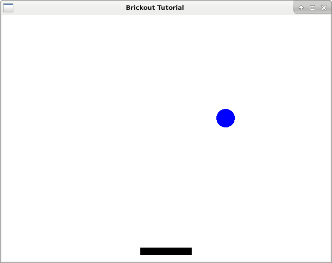

# Paddle Uniform Color

<figure><figcaption><p>Using a different color for different objects</p></figcaption></figure>


We want to be able to change the color of the different components inside the window. In this case, since we're using a different color for each element, we can define color as a uniform and define when we want to switch the color.

```glsl
#version 120

uniform vec3 color;

void main(void) {
	
	gl_FragColor = vec4(color, 1.0);

}
```

Below are the changed to the main.c for implementing color.

```c
#include <epoxy/gl.h>
#include <epoxy/glx.h>
#include <gtk/gtk.h>
#include <math.h>
#include "DashGL/dashgl.h"

#define WIDTH 640.0f
#define HEIGHT 480.0f

static void on_realize(GtkGLArea *area);
static void on_render(GtkGLArea *area, GdkGLContext *context);
static gboolean on_idle(gpointer data);

struct {
	float dx, dy;
	vec3 pos;
	vec3 color;
	mat4 mvp;
	GLuint vbo;
} ball;

struct {
	float dx;
	vec3 pos;
	vec3 color;
	mat4 mvp;
	GLuint vbo;
} paddle;

GLuint program;
GLuint vao;
GLint attribute_coord2d;
GLint uniform_mvp, uniform_color;

int main(int argc, char *argv[]) {

	GtkWidget *window;
	GtkWidget *glArea;

	gtk_init(&argc, &argv);

	// Initialize Window

	window = gtk_window_new(GTK_WINDOW_TOPLEVEL);
	gtk_window_set_title(GTK_WINDOW(window), "Brickout Tutorial");
	gtk_window_set_position(GTK_WINDOW(window), GTK_WIN_POS_CENTER);
	gtk_window_set_default_size(GTK_WINDOW(window), 640, 480);
	gtk_window_set_type_hint(GTK_WINDOW(window), GDK_WINDOW_TYPE_HINT_UTILITY);
	g_signal_connect(window, "destroy", G_CALLBACK(gtk_main_quit), NULL);

	// Initialize GTK GL Area

	glArea = gtk_gl_area_new();
	gtk_widget_set_vexpand(glArea, TRUE);
	gtk_widget_set_hexpand(glArea, TRUE);
	g_signal_connect(glArea, "realize", G_CALLBACK(on_realize), NULL);
	g_signal_connect(glArea, "render", G_CALLBACK(on_render), NULL);
	gtk_container_add(GTK_CONTAINER(window), glArea);

	// Show widgets

	gtk_widget_show_all(window);
	gtk_main();

	return 0;

}

static void on_realize(GtkGLArea *area) {

	// Debug Message

	g_print("on realize\n");

	gtk_gl_area_make_current(area);
	if(gtk_gl_area_get_error(area) != NULL) {
		fprintf(stderr, "Unknown error\n");
		return;
	}

	const GLubyte *renderer = glGetString(GL_RENDER);
	const GLubyte *version = glGetString(GL_VERSION);
	const GLubyte *shader = glGetString(GL_SHADING_LANGUAGE_VERSION);

	printf("Shader %s\n", shader);
	printf("Renderer: %s\n", renderer);
	printf("OpenGL version supported %s\n", version);

	glClearColor(1.0f, 1.0f, 1.0f, 1.0f);

	glGenVertexArrays(1, &vao);
	glBindVertexArray(vao);

	int i;
	float angle, nextAngle;
	int num_segments = 99;

	GLfloat circle_vertices[6 * 100];
	
	for(i = 0; i uniform_name = "color";
	uniform_color = glGetUniformLocation(program, uniform_name);
	if(uniform_color == -1) {
		fprintf(stderr, "Could not bind uniform %s\n", uniform_name);
		return;
	}

	glUseProgram(program);

	mat4 orthograph;
	mat4_orthagonal(WIDTH, HEIGHT, orthograph);

	glUniformMatrix4fv(uniform_ortho, 1, GL_FALSE, orthograph);
	g_timeout_add(20, on_idle, (void*)area);
	
	ball.dx = 2.0f;
	ball.dy = 3.0f;
	ball.pos[0] = 50.0f;
	ball.pos[1] = 50.0f;
	ball.pos[2] = 0.0f;
	ball.color[0] = 0.0f;
	ball.color[1] = 0.0f;
	ball.color[2] = 1.0f;

	paddle.dx = 2.0f;
	paddle.pos[0] = WIDTH / 2.0f;
	paddle.pos[1] = 20.0f;
	paddle.pos[2] = 0.0f;
	paddle.color[0] = 0.0f;
	paddle.color[1] = 0.0f;
	paddle.color[2] = 0.0f;
}

static void on_render(GtkGLArea *area, GdkGLContext *context) {

	glClear(GL_COLOR_BUFFER_BIT | GL_DEPTH_BUFFER_BIT);

	mat4_translate(ball.pos, ball.mvp);
	glUniformMatrix4fv(uniform_mvp, 1, GL_FALSE, ball.mvp);
	glUniform3fv(uniform_color, 1, ball.color);

	glBindVertexArray(vao);
	glEnableVertexAttribArray(attribute_coord2d);

	glBindBuffer(GL_ARRAY_BUFFER, ball.vbo);
	glVertexAttribPointer(
		attribute_coord2d,
		2,
		GL_FLOAT,
		GL_FALSE,
		0,
		0
	);
	glDrawArrays(GL_TRIANGLES, 0, 3 * 100);

	mat4_translate(paddle.pos, paddle.mvp);
	glUniformMatrix4fv(uniform_mvp, 1, GL_FALSE, paddle.mvp);
	glUniform3fv(uniform_color, 1, paddle.color);

	glBindBuffer(GL_ARRAY_BUFFER, paddle.vbo);
	glVertexAttribPointer(
		attribute_coord2d,
		2,
		GL_FLOAT,
		GL_FALSE,
		0,
		0
	);
	glDrawArrays(GL_TRIANGLES, 0, 3 * 2);
	glDisableVertexAttribArray(attribute_coord2d);

}

static gboolean on_idle(gpointer data) {

	ball.pos[0] += ball.dx;
	ball.pos[1] += ball.dy;

	if(ball.pos[0] > WIDTH) {
		ball.pos[0] = WIDTH;
		ball.dx *= -1;
	} else if(ball.pos[0] <0) {
		ball.pos[0] = 0;
		ball.dx *= -1;
	}

	if(ball.pos[1] > HEIGHT) {
		ball.pos[1] = HEIGHT;
		ball.dy *= -1;
	} else if(ball.pos[1] <0) {
		ball.pos[1] = 0;
		ball.dy *= -1;
	}

	gtk_widget_queue_draw(GTK_WIDGET(data));
	return TRUE;

}
```

Compile with:

```bash
$ gcc -c -o DashGL/dashgl.o DashGL/dashgl.c -lepoxy -lpng -lm
$ gcc `pkg-config --cflags gtk+-3.0` main.c DashGL/dashgl.o `pkg-config --libs gtk+-3.0` \
-lepoxy -lm -lpng
```

Run with:

```bash
$ ./a.outs
```
