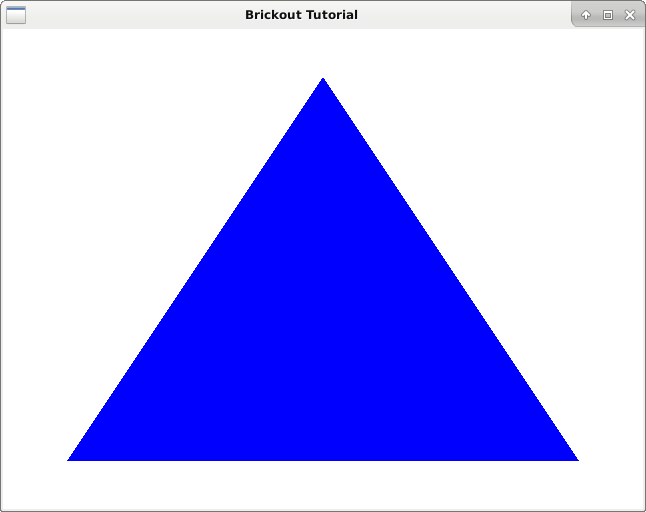

# Separate Shaders

<figure><figcaption><p>Same blue triangle with separate shaders</p></figcaption></figure>

Now that we have tested that GTK and OpenGL works, we're going to move our shader files out of our source code into separate files. We're going to clone DashGL into our project folder for this.

```bash
$ git clone https://github.com/kion-dgl/DashGL-Library.git DashGL
$ mkdir shader
```

Now we can simplify our main.c.

```c
#include <epoxy/gl.h>
#include <epoxy/glx.h>
#include <gtk/gtk.h>
#include "DashGL/dashgl.h"

static void on_realize(GtkGLArea *area);
static void on_render(GtkGLArea *area, GdkGLContext *context);

GLuint program;
GLuint vao, vbo_triangle;
GLint attribute_coord2d;

int main(int argc, char *argv[]) {

	GtkWidget *window;
	GtkWidget *glArea;

	gtk_init(&argc, &argv);

	// Initialize Window

	window = gtk_window_new(GTK_WINDOW_TOPLEVEL);
	gtk_window_set_title(GTK_WINDOW(window), "Brickout Tutorial");
	gtk_window_set_position(GTK_WINDOW(window), GTK_WIN_POS_CENTER);
	gtk_window_set_default_size(GTK_WINDOW(window), 640, 480);
	gtk_window_set_type_hint(GTK_WINDOW(window), GDK_WINDOW_TYPE_HINT_UTILITY);
	g_signal_connect(window, "destroy", G_CALLBACK(gtk_main_quit), NULL);

	// Initialize GTK GL Area

	glArea = gtk_gl_area_new();
	gtk_widget_set_vexpand(glArea, TRUE);
	gtk_widget_set_hexpand(glArea, TRUE);
	g_signal_connect(glArea, "realize", G_CALLBACK(on_realize), NULL);
	g_signal_connect(glArea, "render", G_CALLBACK(on_render), NULL);
	gtk_container_add(GTK_CONTAINER(window), glArea);

	// Show widgets

	gtk_widget_show_all(window);
	gtk_main();

	return 0;

}

static void on_realize(GtkGLArea *area) {

	// Debug Message

	g_print("on realize\n");

	gtk_gl_area_make_current(area);
	if(gtk_gl_area_get_error(area) != NULL) {
		fprintf(stderr, "Unknown error\n");
		return;
	}

	const GLubyte *renderer = glGetString(GL_RENDER);
	const GLubyte *version = glGetString(GL_VERSION);
	const GLubyte *shader = glGetString(GL_SHADING_LANGUAGE_VERSION);

	printf("Shader %s\n", shader);
	printf("Renderer: %s\n", renderer);
	printf("OpenGL version supported %s\n", version);

	glClearColor(1.0f, 1.0f, 1.0f, 1.0f);

	glGenVertexArrays(1, &vao);
	glBindVertexArray(vao);

	GLfloat triangle_vertices[] = {
		 0.0,  0.8,
		-0.8, -0.8,
		 0.8, -0.8
	};
	
	glGenBuffers(1, &vbo_triangle);
	glBindBuffer(GL_ARRAY_BUFFER, vbo_triangle);
	glBufferData(
		GL_ARRAY_BUFFER,
		sizeof(triangle_vertices),
		triangle_vertices,
		GL_STATIC_DRAW
	);

	glVertexAttribPointer(0, 2, GL_FLOAT, GL_FALSE, 0, 0);
	glEnableVertexAttribArray(0);
	glDisableVertexAttribArray(0);
	
	GLint compile_ok = GL_FALSE;
	GLint link_ok = GL_FALSE;
	
	GLuint vs = shader_load_file("shader/vertex.glsl", GL_VERTEX_SHADER);
	GLuint fs = shader_load_file("shader/fragment.glsl", GL_FRAGMENT_SHADER);
	
	program = glCreateProgram();
	glAttachShader(program, vs);
	glAttachShader(program, fs);
	glLinkProgram(program);
	glGetProgramiv(program, GL_LINK_STATUS, &link_ok);
	if(!link_ok) {
		fprintf(stderr, "Error when linking program\n");
		return;
	}

	const char *attribute_name = "coord2d";
	attribute_coord2d = glGetAttribLocation(program, attribute_name);
	if(attribute_coord2d == -1) {
		fprintf(stderr, "Could not bind attribute %s\n", attribute_name);
		return;
	}
}

static void on_render(GtkGLArea *area, GdkGLContext *context) {

	g_print("on render\n");

	glClear(GL_COLOR_BUFFER_BIT | GL_DEPTH_BUFFER_BIT);

	glUseProgram(program);

	glBindVertexArray(vao);
	glEnableVertexAttribArray(attribute_coord2d);

	glBindBuffer(GL_ARRAY_BUFFER, vbo_triangle);
	glVertexAttribPointer(
		attribute_coord2d,
		2,
		GL_FLOAT,
		GL_FALSE,
		0,
		0
	);

	glDrawArrays(GL_TRIANGLES, 0, 3);
	glDisableVertexAttribArray(attribute_coord2d);

}
```

Vertex Shader

```glsl
#version 120

attribute vec2 coord2d;
void main (void) {
	gl_Position = vec4(coord2d, 0.0, 1.0);
}
```

Fragment Shader

```glsl
#version 120

void main(void) {
	
	gl_FragColor[0] = 0.0;
	gl_FragColor[1] = 0.0;
	gl_FragColor[2] = 1.0;

}
```

Compile with:

```bash
$ gcc -c -o DashGL/dashgl.o DashGL/dashgl.c -lepoxy -lpng -lm
$ gcc `pkg-config --cflags gtk+-3.0` main.c DashGL/dashgl.o `pkg-config --libs gtk+-3.0` \
-lepoxy -lm -lpng
```

Run with:

```bash
$ ./a.out
```
